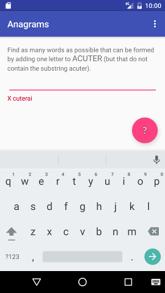

# Anagrams
A word game for Android built as a part of Google CS.
This Repository is a course.

It contain four parts : 

A start view before begin | A view when game start
------------ | -------------
 | 

When you can propose a solution | And if you touch `?` button, you can see solutions
------------ | -------------
 | 
